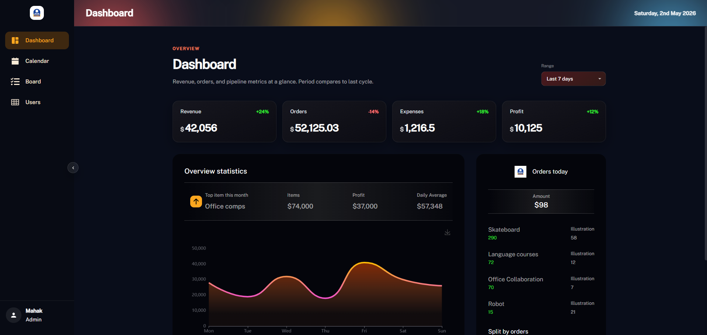

# Digital Business Dashboard

A modern React dashboard application built with Vite, React 19, Redux Toolkit, Material UI, and FullCalendar.

Use of this application includes monitoring business metrics, managing operations with a kanban board, coordinating events on a calendar, and maintaining user data in a responsive data grid.

Live demo: [https://digital-business-dashboard.netlify.app/](https://digital-business-dashboard.netlify.app/)

The app includes a responsive sidebar, dashboard overview, calendar view, kanban board, and data grid for managing users.




## Key Features

- **Responsive layout** with persistent sidebar and sticky header
- **Dashboard overview** with KPI cards, chart widgets, and filter range support
- **FullCalendar integration** for scheduling, event creation, and interaction
- **Kanban board** with drag-and-drop card movement and column reordering
- **Data grid** for user management with add/edit/delete actions
- **Material UI styling** and consistent dark theme design
- **Sidebar collapse/expand** with icon-only compact mode
- **Vite-powered dev experience** for fast builds and hot reload

## Getting Started

Install dependencies:

```bash
npm install
```

Run the development server:

```bash
npm run dev
```

Build for production:

```bash
npm run build
```

Preview the production build:

```bash
npm run preview
```

## Main Dependencies

- `react` / `react-dom` — core React library
- `react-router-dom` — routing and nested layout support
- `@reduxjs/toolkit` / `react-redux` — app state management
- `@mui/material` / `@mui/icons-material` — UI components and icons
- `@dnd-kit/core`, `@dnd-kit/sortable`, `@dnd-kit/utilities` — drag-and-drop kanban interactions
- `@fullcalendar/react`, `@fullcalendar/core`, `@fullcalendar/daygrid`, `@fullcalendar/timegrid`, `@fullcalendar/interaction` — calendar display and event handling
- `echarts` / `echarts-for-react` — chart rendering
- `moment` — date formatting
- `react-icons` — additional iconography

## Project Structure

- `src/App.jsx` — app routes and theme provider
- `src/components/Layouts` — layout, sidebar, and shared page structure
- `src/components/KanbanBoard` — kanban board and card components
- `src/pages` — dashboard, calendar, board, and data grid pages
- `src/features` — Redux slices for board, dashboard, sidebar, and users
- `src/data` — seed data and demo content

## Notes

- The app uses a fixed dark theme and a compact sidebar mode for better workspace focus.
- Kanban card colors and dashboard range filters are implemented in the app logic.
- The current build is optimized for local development on Vite.
